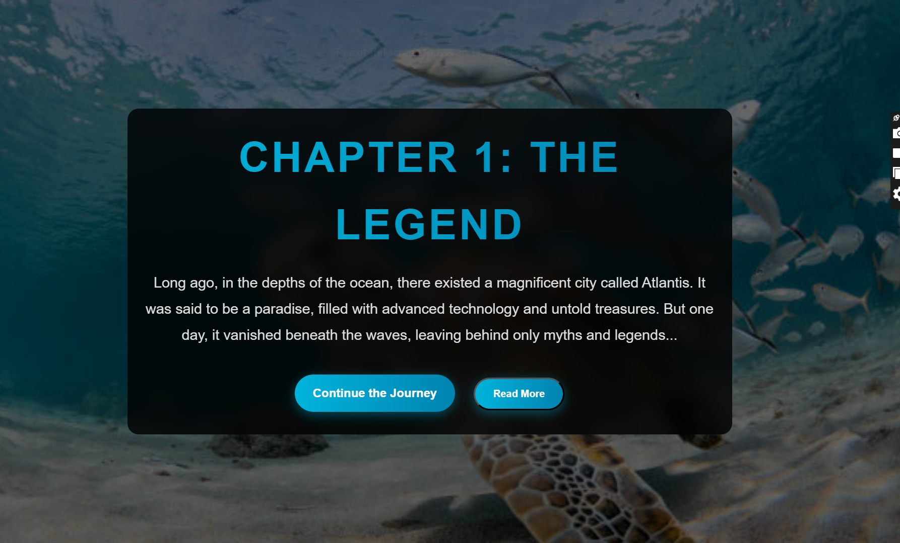

# The Lost City of Atlantis - Storytelling Website



A professional and interactive storytelling website about the lost city of Atlantis. This project features smooth animations, a "Read More" option, and responsive design. Built using **HTML**, **CSS**, and **JavaScript**.

---

## **Features**

- **Full Story**: A 4-chapter story about the lost city of Atlantis.
- **Related Pictures**: High-quality, royalty-free images from Unsplash.
- **Smooth Animations**: Sections fade in and slide up as you scroll.
- **Read More Option**: Toggle additional content for each chapter.
- **Responsive Design**: Optimized for all screen sizes (desktop, tablet, mobile).

---

## **Technologies Used**

- **HTML**: Structure of the website.
- **CSS**: Styling and animations.
- **JavaScript**: Scroll animations and "Read More" functionality.

---

## **How to Use**

1. **Clone the Repository**:
   ```bash
   git clone https://github.com/Muhammadimam156/Storytelling-Website.git
   cd storytelling-website
